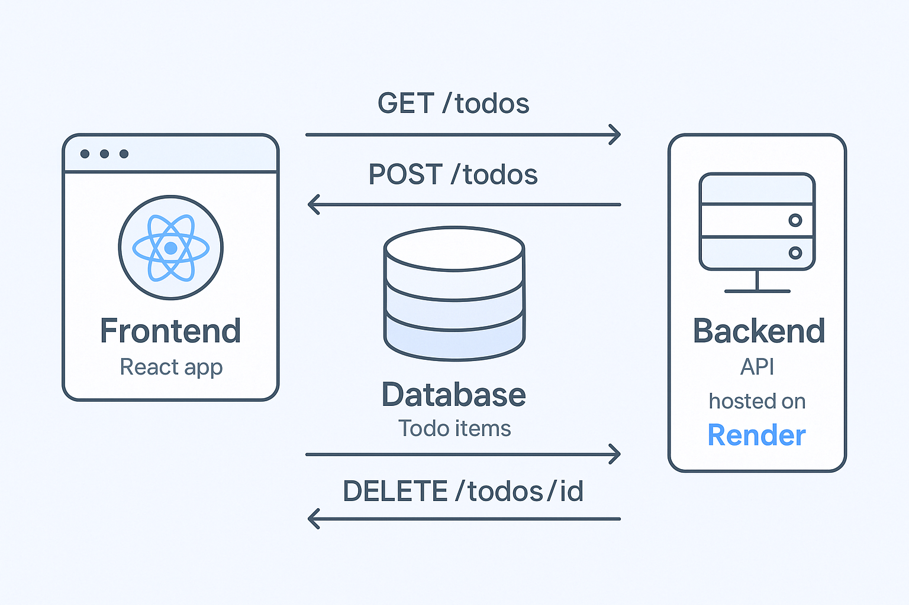

# 📝 Todo List API



This is a simple RESTful API built with **Node.js**, **Express**, and **MongoDB** to manage a todo list. It allows users to perform CRUD operations—Create, Read, Update, and Delete—on todo items. This API is designed to be consumed by a frontend application.

## 🚀 Features

-  Create new todo items
-  View all todo items
-  Update the title or completion status of a todo
-  Delete a todo item
-  Cross-Origin Resource Sharing (CORS) enabled
-  Connected to a MongoDB database

## 📦 Technologies Used

-  Node.js
-  Express.js
-  MongoDB with Mongoose
-  CORS Middleware
-  Render (for deployment)

## 📂 Project Structure

```
todo-api/
├── models/
│   └── Todo.js        # Mongoose schema for todo items
├── routes/
│   └── todos.js       # Route handlers for /todos
├── .env               # Environment variables (MongoDB URI, Port)
├── server.js          # Entry point, sets up the Express app
├── package.json       # Project metadata and dependencies
```

## 🔧 Setup Instructions

1. **Clone the repository**

   ```bash
   git clone https://github.com/yourusername/todo-api.git
   cd todo-api
   ```

2. **Install dependencies**

   ```bash
   npm install
   ```

3. **Set up your environment variables**  
   Create a `.env` file and add your MongoDB URI:

   ```
   MONGODB_URI=your_mongodb_connection_string
   PORT=3500
   ```

4. **Run the server**

   ```bash
   npm start
   ```

   The API will be available at `http://localhost:3500`.

## 📬 API Endpoints

| Method | Endpoint     | Description            |
| ------ | ------------ | ---------------------- |
| GET    | `/todos`     | Fetch all todos        |
| POST   | `/todos`     | Add a new todo         |
| PUT    | `/todos/:id` | Update a specific todo |
| DELETE | `/todos/:id` | Delete a specific todo |

## 🌐 CORS

CORS is enabled to allow requests from frontend applications hosted on different origins.

## 💡 Future Improvements

-  Add user authentication
-  Pagination and search
-  Unit and integration tests

## 👤 Author

**John Quarmor**

-  Twitter: [@romrauq](https://twitter.com/romrauq)
-  GitHub: [@romrauq](https://github.com/romrauq)
-  LinkedIn: [John Quarmor](https://linkedin.com/in/johnquarmor)
